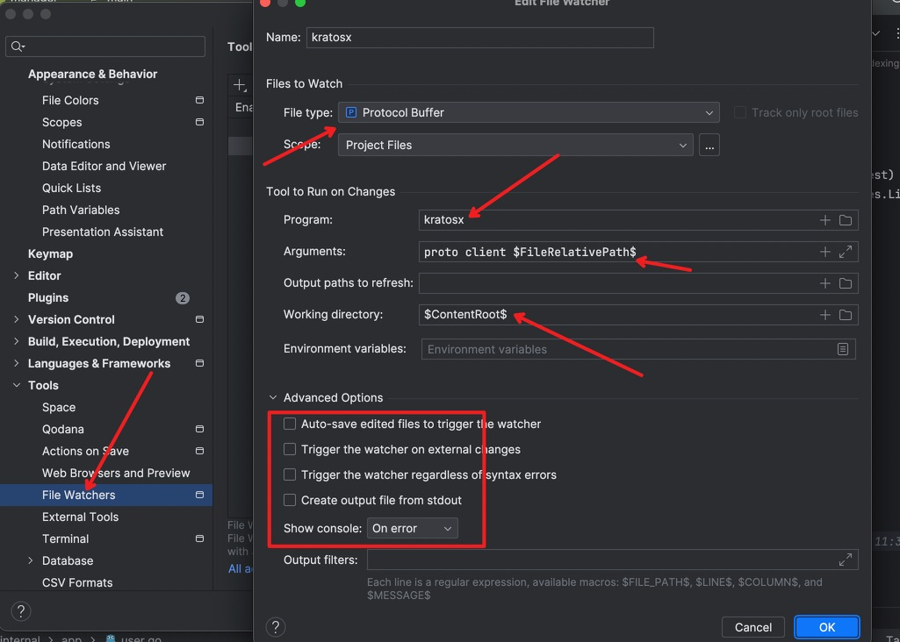

kratos cli 的主要功能是进行创建项目、proto代码生成grpc、http、error代码。此cli工具在kratos原cli工具上做了一些调整和功能的增加，你可以使用kratos cli更加如鱼得水的开发你的项目。

## 执行安装命令
```shell
go install github.com/limes-cloud/kratosx/cmd/kratosx@latest &&\
go install github.com/limes-cloud/kratosx/cmd/protoc-gen-go-httpx@latest &&\
go install github.com/limes-cloud/kratosx/cmd/protoc-gen-go-errorsx@latest &&\
go install google.golang.org/protobuf/cmd/protoc-gen-go@latest &&\
go install google.golang.org/grpc/cmd/protoc-gen-go-grpc@latest &&\
go install github.com/google/gnostic/cmd/protoc-gen-openapi@latest &&\
go install github.com/envoyproxy/protoc-gen-validate@latest
```
如果出现执行失败，检测一下自己网路是否可以访问github。当然我还是在这里和大家说一下各个插件的作用。
- protoc-gen-go-http：主要是生成服务中的http端代码
- protoc-gen-go-errors：主要是用于生成全局error
- protoc-gen-go: 主要是用户生成pb代码。
- protoc-gen-go-grpc: 主要是用于生成grpc代码。
- protoc-gen-openapi：主要是用户生成openapi.yaml
- protoc-gen-validate: 主要是用户生成验证器，用于验证参数。


验证是否完成安装
```shell
 kratosx -v
```

## 创建项目
```shell
# kratosx new [项目名]
kratosx new helloworld
```

使用 `-r` 指定源
```shell
# 拉取kratosx layout模板
kratosx new helloworld -r https://github.com/limes-cloud/kratos-layout.git

# 拉取kratos layout模板
kratosx new helloworld -r https://github.com/go-kratos/kratos-layout.git

# 亦可使用自定义的模板
kratosx new helloworld -r xxx-layout.git
```

使用 `-b` 指定分支

```shell
kratosx new helloworld -b main
```

使用 `--nomod` 添加服务，共用 `go.mod` ，大仓模式
```shell
kratosx new helloworld
cd helloworld
kratosx new app/user --nomod
```

## 生成 Proto 代码
kratosx 支持service定义和message定义分离。
```shell
kratosx proto client api/helloworld/v1/demo.proto
```

### 配置Goland自动化生成Proto代码
1）打开Goland设置  
2）找到Tool 》 File Watcher  
3）添加custom配置,文件类型选择proto buffer  
4）配置一下命令,program 选择你下载的protoc,args配置为以下代码


## 其他安装
除此之外，要完全启动项目，还需要安装mysql、redis。如果需求启动多节点，还需要安装额外的服务发现中间件，比如etcd、consul等。这里我就不再详细的赘述了，但至少保证你的开发环境中mysql、redis是可用的。
