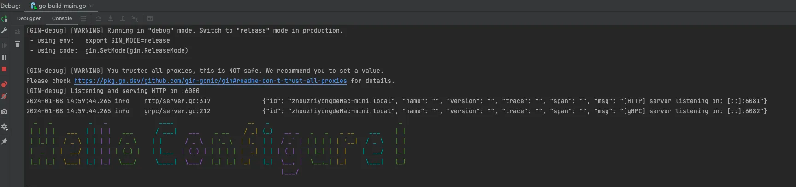
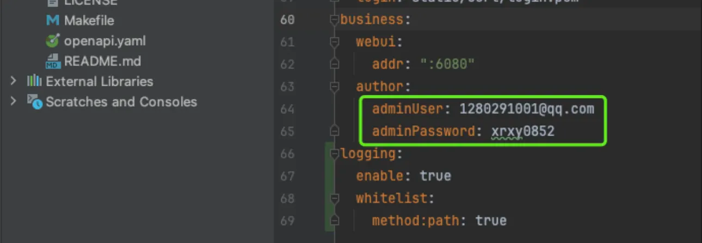
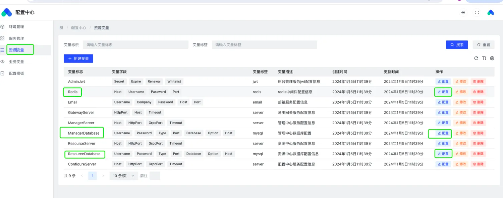
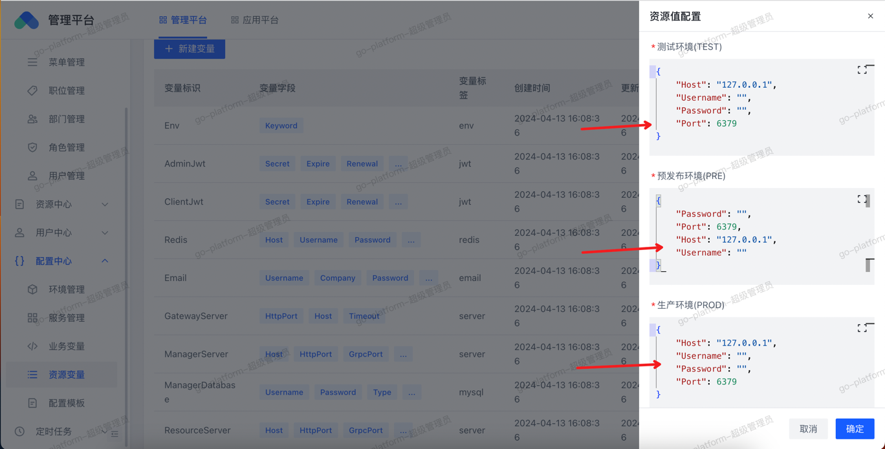
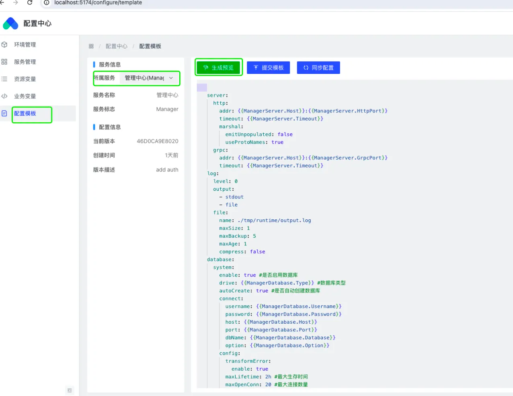
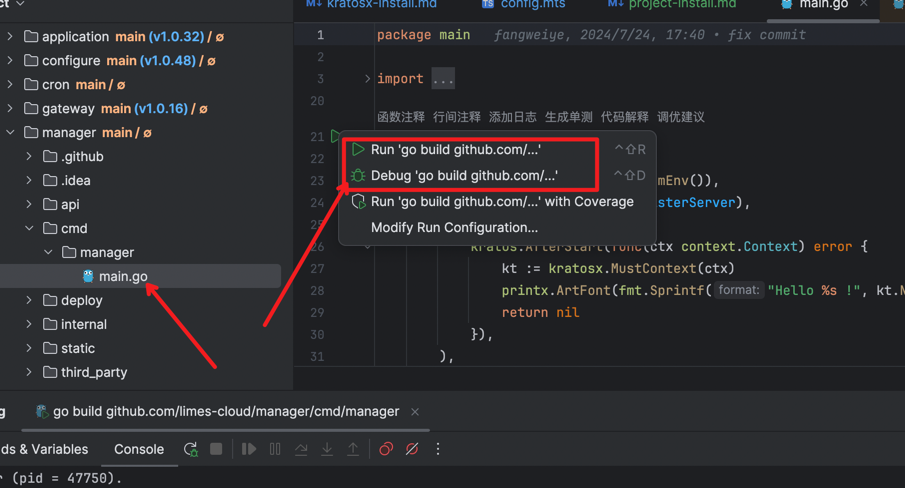
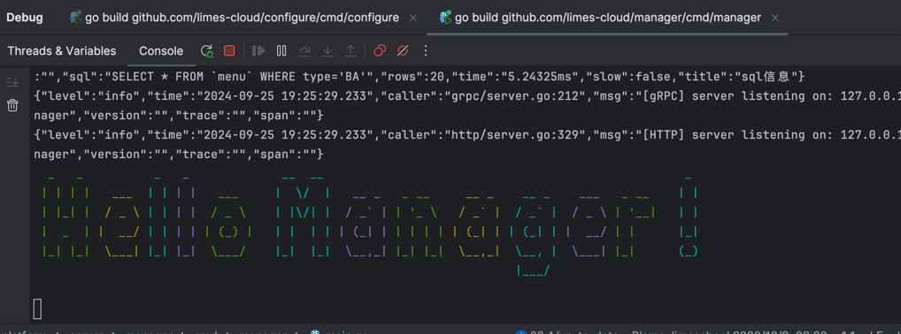
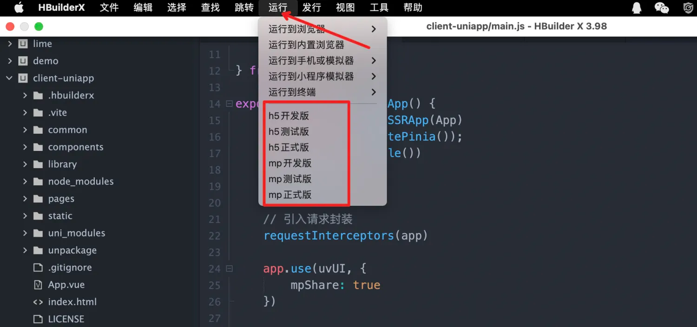

当然在部署之前还需要一mysql、redis.中间件，相信你已经准备好了。

## 拉取项目全部代码
```shell 
git clone  https://github.com/limes-cloud/go-platform.git --recurse-submodules
```

## 启动配置中心
配置中心项目代码位于server/configure目录下。作为整个架构体系中最基础的服务，在启动其他服务之前需要先启动配置中心，当然你也可以使用服务本身的配置文件作为配置源进行启动，但是这并不是我推荐的做法，所以这里我们还是按照步骤，先启动配置中心吧。

### 修改配置中心服务配置
进入server/confugure/conf目录下，修改conf.yaml中的mysql配置中的账号密码为你的数据库的账号密码，你仅仅只用配置账号密码即可，保证数据库可以进行正常的连接，数据库可以依靠系统进行自动创建并完成初始化的，并同时会生成其他服务的配置文件数据。

```shell
cd server/configure & go run cmd/configure/main.go
```
看到以下控制台输出则代码运行成功了。


### 打开配置中心管理面板
在第一次使用是，配置文件都是依靠系统自动初始化的，mysql、redis的配置都是测试数据，所以你在启动其他服务接入配置中心之前，需要先修改对应服务的配置数据才能进行正常启动。 配置中心作为最基础的服务，拥有独立的管理面板进行管理操作，你可以在后续的服务启动之前，进入到配置中心提前配置服务的配置信息。

管理地址：`localhost:6080`  
具体的地址和访问的账号密码是可以在启动的配置文件中进行配置的。

通过账号密码即可登陆进入配置中心配置项目的配置。

### 如何修改指定服务配置
在项目中，除了配置中心之外，还有`manager`、`resource`、`application`、`cron`等多个服务，每个服务启动时都是需要加载配置启动的，以下以`manager`服务为例，进行配置的修改并启动。后续的服务按照此类方法进行修改即可。

#### 选择资源中心菜单

找到对应的redis、mysql配置，点击右侧的配置，根据不同的环境填写对应的值，保存即可。如下图


#### 修改&同步配置
资源变量配置完后，在配置模板处选择对应服务，点击生成预览，查看资源变量配置是否生效。

确认生效后，点击同步配置即可。接下来我们就开始启动manager服务了。

## 启动manager服务
在启动manager服务之前，我们需要先修改服务的环境变量。以GoLand为例。
  
在弹出的框中输入以下配置
```azure
APP_NAME=Manager;CONF_HOST=127.0.0.1:6082;CONF_TOKEN=xxx
```
`APP_NAME`：是服务的名称，可以在配置中心管理平台下的服务管理中进行查看。  
`CONF_HOST`: 是配置中心的地址。  
`CONF_TOKEN`：是配置中心的token，可以在配置中心管理平台下的环境管理中重置、查看token。    
  
如果后续启动失败，请确认`APP_NAME`、`CONF_HOST`、`CONF_TOKEN`是否配置正确。

进入manager/cmd/manager/main.go 启动项目

看到如下信息，则启动成功。


按照同样的方式，在分别启动其他服务即可。

## 启动PC管理端
在启动pc管理端之前，确保电脑有 node.js, npm, pnpm 环境。紧接着，执行以下命令进行启动。
```shell
cd web/admin-web

# 安装 node module 包
pnpm install

# 执行运行命令
pnpm run dev
```

## 启动Client用户端
启动client用户端需要下载使用uni-app的专用编辑器hbuilderx。下载完成之后使用hbuilderx打开client-uniapp目录。



## docker一键部署
### 安装configure
在进行部署之前，如果你需要修改配置中心的配置，你可以直接修改go-platform/deploy/configure/config/config.ayml文件进行配置，然后执行docker-compose启动服务即可。
``` 
# 进入部署目录
cd deploy/configure
# 执行部署
docker-compose up -d
```

### 安装其他服务
配置中心是管理其他服务配置的服务，所以必须先启动，启动配置中心之后，需要进行服务配置，方法可参照上面本地部署的示例中的配置服务，主要就是配置服务的数据库账号和密码，确保账号密码正确，配置完成之后启动服务即可。
```shell 
# 进入部署目录
cd deploy
# 执行部署
docker-compose up -d 
```