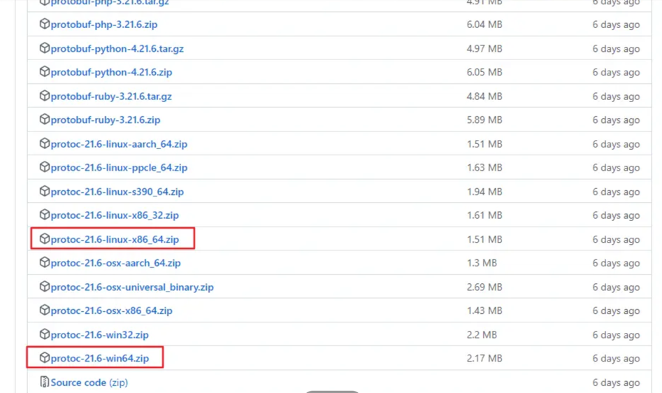

Protocol Buffers（简称 Protobuf）是 Google 创建的一种语言无关、平台无关的可扩展机制，用于序列化结构化数据，比如在网络通信和数据存储中。它类似于 XML、JSON，但是更加高效、更小，并且更易于维护

你可以使用它来定义消息（message）的结构。这些消息结构一旦定义好，就可以使用 Protobuf 提供的工具自动生成源代码，用于各种语言（如 Java、C++, Python, Go等）来进行数据的序列化和反序列化。

## 为什么要选择使用 Protocol Buffers？
- 效率高： Protobuf 设计出来就是为了高效，序列化后的数据小，处理速度快。
- 强类型： 由于定义时需要指定数据类型，因此序列化和反序列化时能够确保类型安全。
- 兼容性好： Protobuf 被设计为向前和向后兼容，即使数据结构发生变化，新旧版本的数据定义也能够互相理解。
- 跨平台和语言无关： Protobuf 支持多种编程语言，能够轻松实现不同语言或平台间的数据交换。
- 自动化代码生成： Protobuf 编译器能够自动生成不同编程语言的数据访问类，减少手动编码。
- 清晰的结构定义： Protobuf 使得数据结构在 .proto 文件中一目了然，便于管理和维护。

## 安装 Protocol Buffers
### 下载
- 访问 Protocol Buffers 的 GitHub 仓库页面：[protobuf](https://github.com/protocolbuffers/protobuf)
- 点击“Releases”标签，找到最新的稳定版本。
- 根据你的操作系统下载对应的预编译二进制文件或源代码包。



### 安装
`Windows`

解压下载的压缩包。
找到 bin 目录，将 protoc.exe 文件的路径添加到系统环境变量的 PATH 中。

`macOS / Linux`

解压下载的压缩包。
在终端中，使用 sudo 将 protoc 文件复制到 /usr/local/bin/ 目录下。
sudo cp protoc /usr/local/bin/protoc
确保 /usr/local/bin 在你的 PATH 环境变量中。

验证是否安装成功
```shell
protoc --version
```
